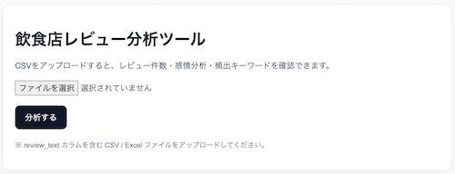
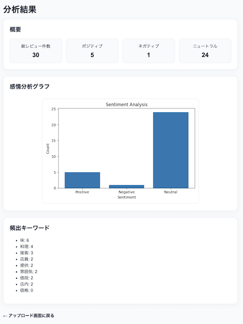

# 飲食店レビュー分析ツール (Restaurant Review Analyzer)

Python（FastAPI + pandas）で構築した、飲食店レビュー分析ツールです。  
CSVファイルをアップロードするだけで、レビューの傾向を可視化できます。
店舗改善に役立つインサイトを、シンプルに可視化することを目的としています。

具体的には、以下の分析結果を確認できます。

- 感情分析（ポジティブ / ネガティブ）
- レビュー件数の集計
- 頻出キーワードの抽出

---

## デモ

https://restaurant-review-analyzer-u7dc.onrender.com/

---

## スクリーンショット

### アップロード画面



### 分析結果



### 感情分析グラフ


---

## 機能（MVP）

- CSVアップロード
- レビュー件数の集計
- 感情分析（Positive / Negative / Neutral）
- 頻出キーワード抽出
- 感情分析グラフ（棒グラフ）

---

## 技術スタック

- Python
- FastAPI
- pandas
- matplotlib
- Jinja2
- janome（今後拡張予定）

※ 本番環境では Python 3.12 を使用しています（matplotlibの互換性対応）

---

## 画面構成

```
/        CSVアップロード画面
/analyze 分析結果画面
```


---

## データの流れ

CSVアップロード
↓
pandasで読み込み
↓
テキスト分析（感情・キーワード）
↓
集計
↓
グラフ生成
↓
結果表示

---

## CSVフォーマット

```csv
review_text
料理がとても美味しかった
店員さんの対応が冷たかった
提供が遅かったけど味はよかった
```

※ review_text カラムが必須

---

## セットアップ

```bash
git clone https://github.com/norviaio/restaurant-review-analyzer.git
cd restaurant-review-analyzer

python3 -m venv venv
source venv/bin/activate

pip install -r requirements.txt

uvicorn app.main:app --reload
```

http://localhost:8000 にアクセス

---

## 設計のポイント

### シンプルな分析構成

機械学習モデルは使用せず、ルールベースで感情分析を実装しています。
これにより、処理の流れが分かりやすく、拡張しやすい構成にしています。

### Python完結構成

フロントエンドとバックエンドを分離せず、FastAPI + Jinja2で完結する構成としています。
分析処理に集中できる設計です。

---

## 今後の拡張

- 形態素解析（janome）による精度向上
- ネガティブレビュー抽出
- カテゴリ分類（味 / 接客 / 価格など）
- ワードクラウド
- UI改善

---

## ライセンス

本プロジェクトはポートフォリオ用途のため、商用利用は想定していません。
