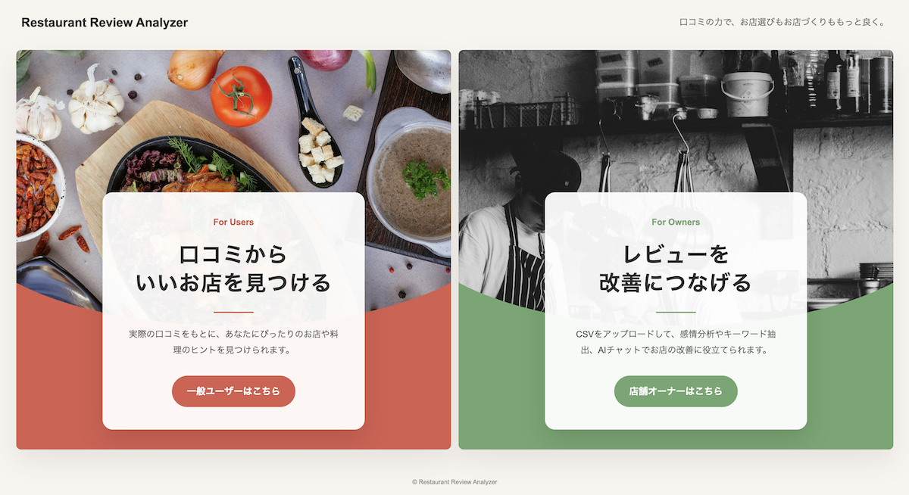
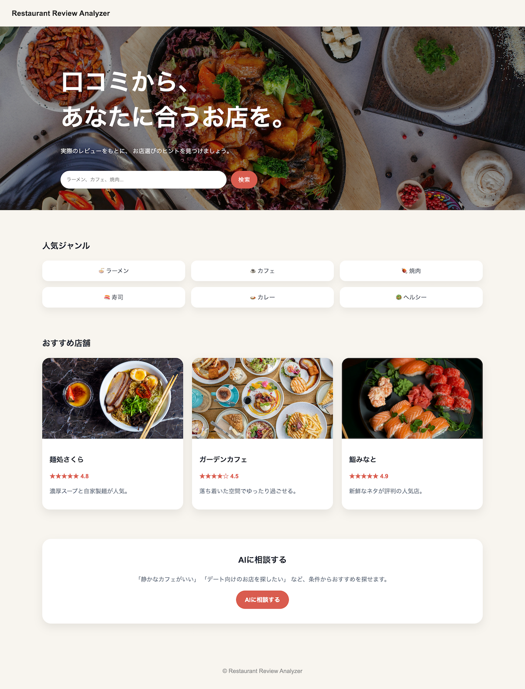
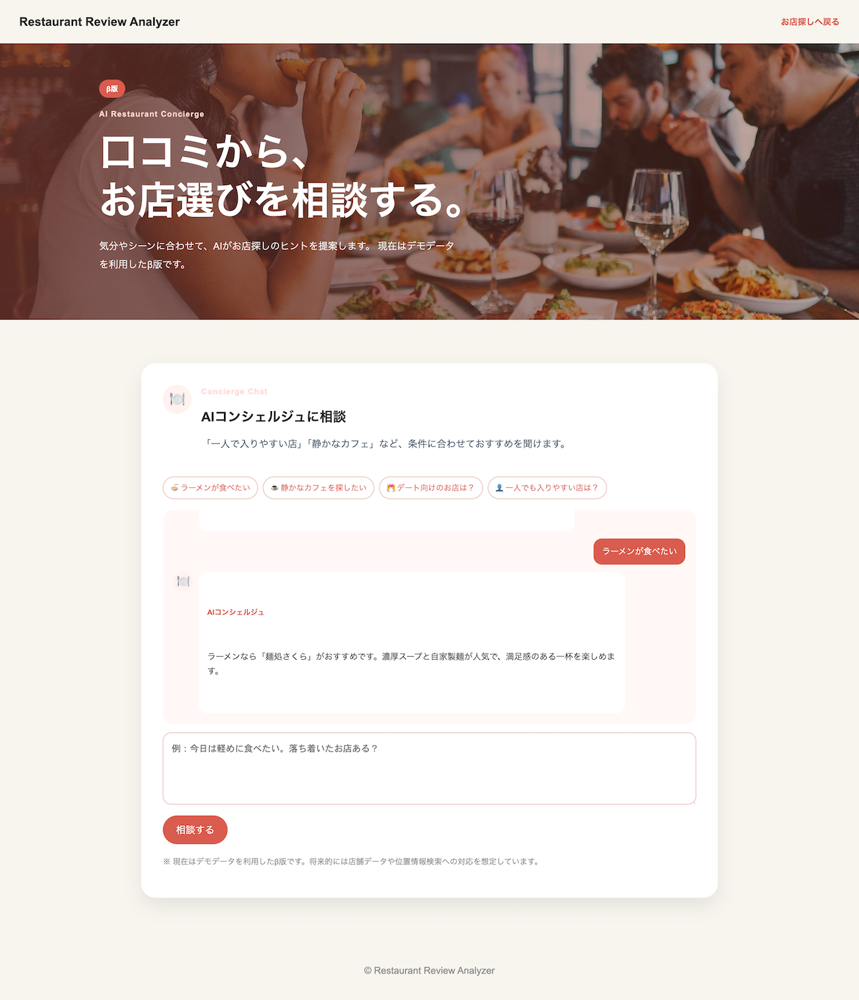
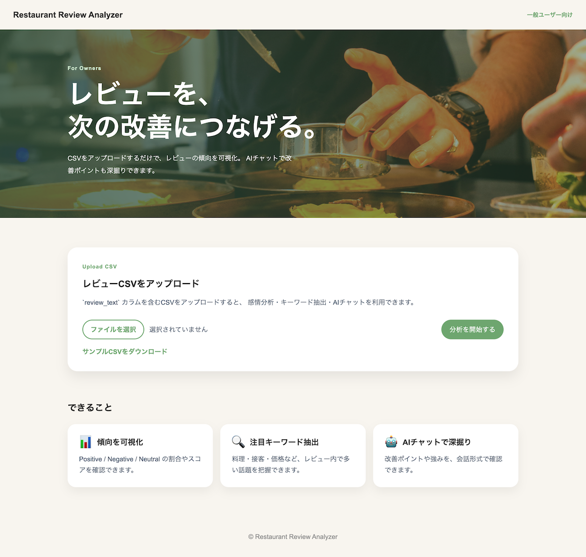
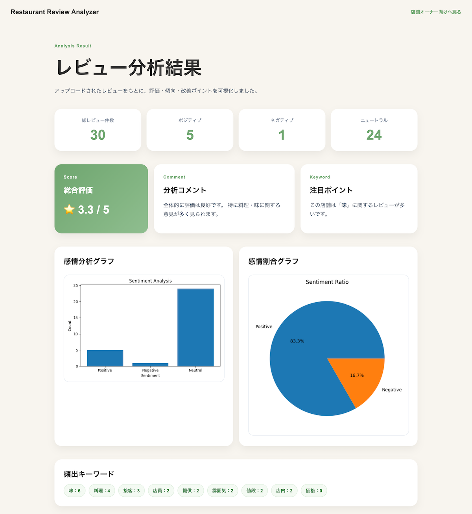
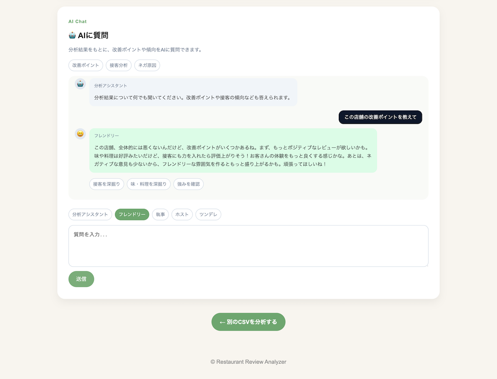

# Restaurant Review Analyzer

Python（FastAPI + pandas）で構築した、飲食店レビュー活用サービスです。

消費者向け（B2C）には、お店探しやAIコンシェルジュ機能を提供し、
店舗向け（B2B）には、レビュー分析や改善提案機能を提供しています。

口コミを「読む」だけでなく、

- 利用者は自分に合ったお店を探す
- 店舗は評価や改善ポイントを把握する

という、同じレビュー情報を異なる視点で活用できるサービスとして開発しました。

さらに、分析結果をもとにAIへ質問することで、
改善提案や課題整理を対話形式で行うことができます。

---

## デモ

公開環境で実際に動作を確認できます。

https://restaurant-review-analyzer-u7dc.onrender.com/

Consumer（B2C）のお店探し機能と、
Owner（B2B）のレビュー分析機能の両方を体験できます。

### デモ用CSV

Owner（B2B）機能のレビュー分析は、以下のサンプルCSVで試すことができます。

[sample_reviews.csv](samples/sample_reviews.csv)

---

## 主な機能

### Consumer（B2C）

- おすすめ店舗の閲覧
- 人気ジャンルの表示
- AIコンシェルジュ β
- 利用シーンに応じた店舗提案

### Owner（B2B）

- CSVアップロードによるレビュー読み込み
- 感情分析（Positive / Negative / Neutral）
- キーワード抽出（頻出ワード）
- グラフ表示（棒グラフ・円グラフ）
- 総合評価スコア（★5段階）
- 分析コメント自動生成
- 注目キーワードの提示
- AIチャット機能（分析結果に基づく改善提案・要約・課題抽出）

---

## スクリーンショット

### TOP



### Consumer（B2C）

おすすめ店舗や人気ジャンルを確認できます。



### Consumer Chat β

会話形式で店舗を探せるコンシェルジュ機能です。



### Owner（B2B）

レビューCSVをアップロードして分析できます。



### Analyze

レビュー分析結果を可視化します。



AIチャットによる改善提案も確認できます。



---

## 使用方法

### Consumer（B2C）

1. 「お店を探す」へアクセス
2. おすすめ店舗や人気ジャンルを確認
3. AIコンシェルジュ β に相談
4. シーンや好みに合わせた店舗提案を受ける

### Owner（B2B）

1. CSVファイルを用意（カラム名：review_text）
2. アプリにアップロード
3. 分析結果を確認（感情分析・キーワード・スコア）
4. 「AIに質問」から改善ポイントや課題を確認

### AI質問例

#### Consumer（B2C）

- 静かなカフェを探したい
- 一人でも入りやすいお店は？
- デート向けのお店を教えて
- 今日はラーメンが食べたい

#### Owner（B2B）

- この店舗の改善ポイントを教えて
- 接客に関する評価をまとめて
- ネガティブレビューの原因は？
- お客様から評価されているポイントは？
- リピーターを増やすにはどうすればいい？

---

## CSVフォーマット

Owner（B2B）機能では、以下の形式のCSVファイルを利用します。

```csv
review_text
料理がとても美味しかった
店員の対応が冷たかった
提供が遅かったが味は良かった
```

※ review_text カラムが必須

---

### AI機能

#### Consumer（B2C）

AIコンシェルジュに相談することで、利用シーンや好みに応じた店舗提案を受けることができます。

- 一人でも入りやすいお店の提案
- デート向け店舗の提案
- ジャンルや雰囲気に応じた店舗提案

#### Owner（B2B）

分析結果をもとに、AIへ質問することができます。

- 改善ポイントの提案
- 接客・味などの観点別分析
- 強みや課題の整理
- レビュー傾向の要約

---

## 技術スタック

### バックエンド / API

- Python
- FastAPI（API / Webアプリケーション）

### データ処理 / 分析

- pandas（データ処理・集計）
- janome（日本語テキスト解析 ※今後拡張予定）

### 可視化

- matplotlib（グラフ生成）

### フロントエンド

- Jinja2（テンプレート）
- HTML / CSS / JavaScript

### AI

- OpenAI API（分析結果に基づく質問応答）

### インフラ

- Render（デプロイ・公開環境）

※ 本番環境では Python 3.12 を使用しています（matplotlibの互換性対応）

---

## データ処理フロー

CSVアップロード  
↓  
pandasで読み込み  
↓  
テキスト解析（キーワード・感情）  
↓  
集計  
↓  
可視化（グラフ・スコア）  
↓  
AIによる分析結果の解釈・改善提案（Owner機能）

---

Consumer機能では、レビュー情報や店舗データをもとに
コンシェルジュ機能（β版）が店舗提案を行います。

---

## 設計のポイント

### B2C / B2B の両視点でレビューを活用

同じレビュー情報を、

- Consumer（B2C）では「お店探し」
- Owner（B2B）では「レビュー分析・改善提案」

という異なる目的で活用できる構成にしています。

単なるレビュー分析ツールではなく、
レビュー情報の活用方法そのものを提案するサービスとして設計しました。

### シンプルな感情分析ロジック

機械学習モデルではなく、キーワードベースで分類することで、
軽量かつ理解しやすい構成にしています。

分析ロジックをシンプルにすることで、
結果の解釈や拡張を行いやすい設計としています。

### 指標化による可視化

レビューを以下のように変換しています。

- Positive：5点
- Neutral：3点
- Negative：1点

これにより、テキスト中心のレビューを定量的に評価し、
全体傾向を★5段階のスコアとして可視化しています。

### 実務を意識した設計

店舗運営者が扱うレビューCSVを想定し、
非エンジニアでも利用しやすいシンプルな操作性を意識しています。

- CSVアップロードによる分析
- グラフによる可視化
- キーワード抽出
- AIによる改善提案

### AIによる意思決定支援

Owner機能では、分析結果をもとにAIへ質問することで、
改善提案や課題整理を行うことができます。

またConsumer機能では、
会話形式で店舗を探せるコンシェルジュ機能（β版）を提供しています。

---

## 画面構成

```
/ TOPページ

Consumer（B2C）
├ /consumer
└ /consumer-chat

Owner（B2B）
├ /owner
└ /analyze
```

---

## セットアップ

```bash
git clone https://github.com/norviaio/restaurant-review-analyzer.git
cd restaurant-review-analyzer

python3 -m venv venv
source venv/bin/activate

pip install -r requirements.txt

uvicorn app.main:app --reload
```

http://localhost:8000 にアクセス

### 環境変数

OpenAI機能を利用する場合は、プロジェクトルートに `.env` を作成し、以下を設定してください。

```bash
OPENAI_API_KEY=your_api_key
```

---

## テスト

pytest を用いて、AIチャットAPIの簡易テストを実施しています。

### テスト内容

- AIチャットAPIの正常系テスト
- AIチャットAPIの異常系テスト

### 実行方法

```bash
PYTHONPATH=. pytest
```

---

## 今後の拡張

### Consumer（B2C）

- 店舗データのDB管理
- 検索・フィルタ機能
- 位置情報を利用した店舗検索
- お気に入り機能
- AIコンシェルジュ β の回答精度向上

### Owner（B2B）

- ネガティブレビュー抽出
- カテゴリ分類（接客 / 味 / 価格など）
- ワードクラウド
- 分析結果の期間比較
- 店舗ごとの分析履歴管理

---

## ライセンス

本プロジェクトはポートフォリオ用途として作成しています。
