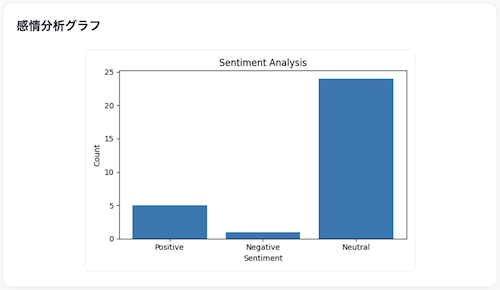
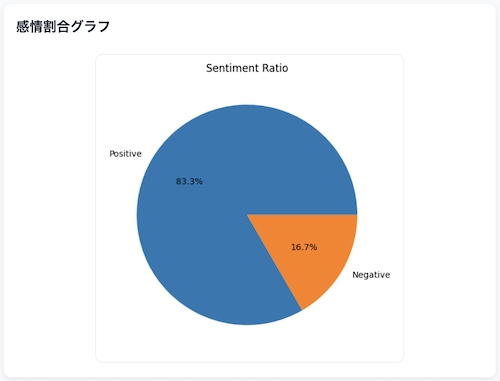

# 飲食店レビュー分析ツール (Restaurant Review Analyzer)

Python（FastAPI + pandas）で構築した、飲食店レビュー分析ツールです。  
CSVファイルをアップロードするだけで、レビューの傾向を可視化できます。

レビューを「読む」だけでなく、  
飲食店の評価・傾向・改善ポイントを一目で把握できるツールとして開発しました。

---

## デモ

実際にCSVをアップロードして動作を確認できます。

https://restaurant-review-analyzer-u7dc.onrender.com/

デモ用のCSVはこちらから利用できます。

[sample_reviews.csv](samples/sample_reviews.csv)

---

## 主な機能

- CSVアップロードによるレビュー読み込み
- 感情分析（Positive / Negative / Neutral）
- キーワード抽出（頻出ワード）
- グラフ表示（棒グラフ・円グラフ）
- 総合評価スコア（★5段階）
- 分析コメント自動生成
- 注目キーワードの提示

---

## スクリーンショット

### アップロード画面


### 分析結果


### 感情分析グラフ



### 感情割合グラフ



---

## 使用方法

1. CSVファイルを用意（カラム名：`review_text`）
2. アプリにアップロード
3. 分析結果を確認

---

## CSVフォーマット

```csv
review_text
料理がとても美味しかった
店員の対応が冷たかった
提供が遅かったが味は良かった
```

※ review_text カラムが必須

---

## 技術スタック

- Python
- FastAPI（API / Webアプリケーション）
- pandas（データ処理）
- matplotlib（可視化）
- Jinja2（テンプレート）
- janome（今後拡張予定）

※ 本番環境では Python 3.12 を使用しています（matplotlibの互換性対応）

---

## データ処理フロー

CSVアップロード
↓
pandasで読み込み
↓
テキスト解析（キーワード・感情）
↓
集計
↓
可視化（グラフ・スコア）

---

## 設計のポイント

### シンプルな感情分析ロジック

機械学習モデルではなく、キーワードベースで分類することで
軽量かつ理解しやすい構成にしています。

### 指標化による可視化

レビューを以下のように変換しています：

- Positive：5点
- Neutral：3点
- Negative：1点

これにより、レビュー全体を★5段階評価として表現しています。

### 実務を意識した設計

実際の業務データ（CSV）を想定し、非エンジニアでも扱えるシンプルな操作性を意識しています。

- CSVアップロード形式（業務データを想定）
- 分析結果の可視化
- 改善ポイントの抽出（コメント・キーワード）

---

## 画面構成

```
/        CSVアップロード画面
/analyze 分析結果画面
```

---

## セットアップ

```bash
git clone https://github.com/norviaio/restaurant-review-analyzer.git
cd restaurant-review-analyzer

python3 -m venv venv
source venv/bin/activate

pip install -r requirements.txt

uvicorn app.main:app --reload
```

http://localhost:8000 にアクセス

---

## 今後の拡張

- ネガティブレビュー抽出
- カテゴリ分類（接客 / 味 / 価格など）
- ワードクラウド
- 検索・フィルタ機能

---

## ライセンス

本プロジェクトはポートフォリオ用途として作成しています。
